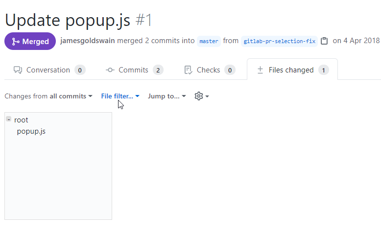

# chrome
BETA:
This is a basic github chrome extension, supporting .net/js solutions to enable a hierarchical treeview of PR commits

# how to use
Currently this chrome extension is required to be loaded as an unpacked extension in Developer mode

Once installed navigate to any pull request in GitHub (e.g. https://github.com/jamesgoldswain/pr-tree/pull/1/files)

Refresh the page and PR Tree should render as below

## Preview

## Contact